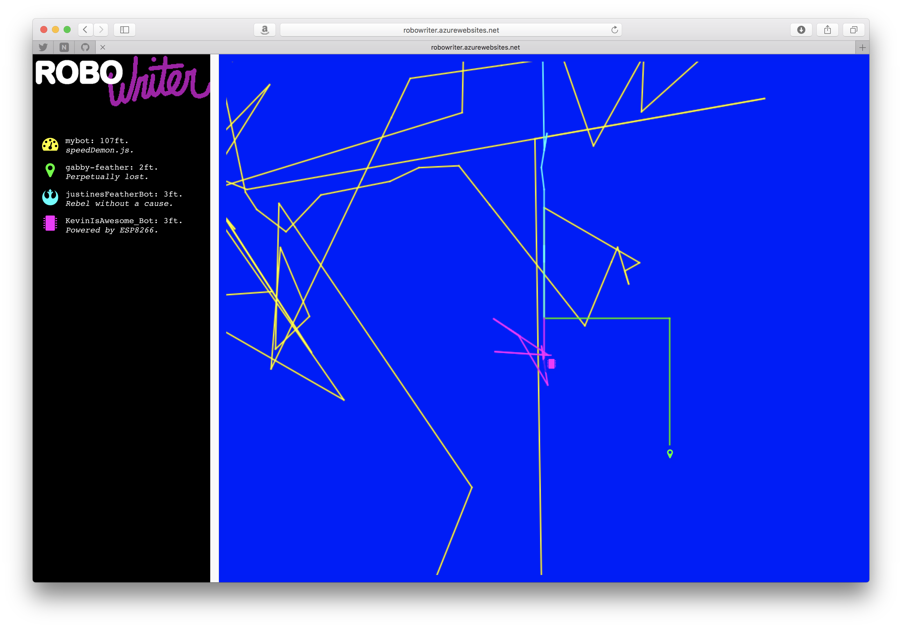

# RoboWriter

This dashboard shows the motion of real-life robotic cars connected to an Azure IoT Hub via WiFi. It's a playful wink to my first programming experience at age 7: LogoWriter for the Apple IIGS.

## Technology stack
 - NodeBots: Robotic cars powered by Adafruit Feather Huzzah microcontrollers running [Johnny-Five](https://github.com/rwaldron/johnny-five) Javascript framework
 - [iothub-explorer](https://www.adafruit.com/products/3032): A CLI tool that allows individuals to register devices to an Azure IoT Hub
 - Azure IoT Hub + Streaming Analytics: Cloud services to injest and transform lots of data from lots of connected devices
 - Azure Functions: "Serverless" node.js code triggered by IoT Hub activity to store incoming data to a table
 - Azure Table Storage: A table in zee cloud that stores the data
 - [jtg](https://github.com/greim/jtg): A JavaScript library that emulates LOGO, used to take NodeBots data and draw it to an HTML canvas
 - socket.io: Keeps the web view updated
